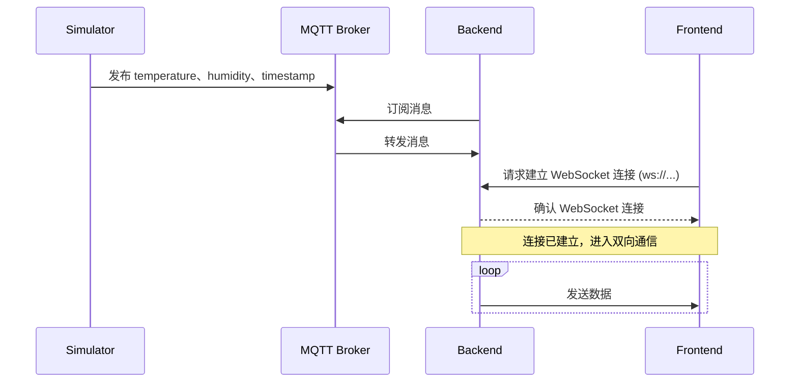
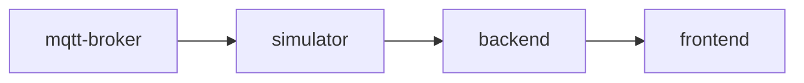

# IOT Data Monitor

## 文件夹目录

- mqtt-broker
mqtt服务器：提供消息发布和订阅功能。

- simulator
模拟传感器：向mqtt发送temperature、humidity、timestamp。

- backend
模拟后端：接收mqtt的temperature、humidity、timestamp，并进行处理。

- frontend
前端：实时展示温度和湿度数据。

## 项目架构

## 项目启动顺序

